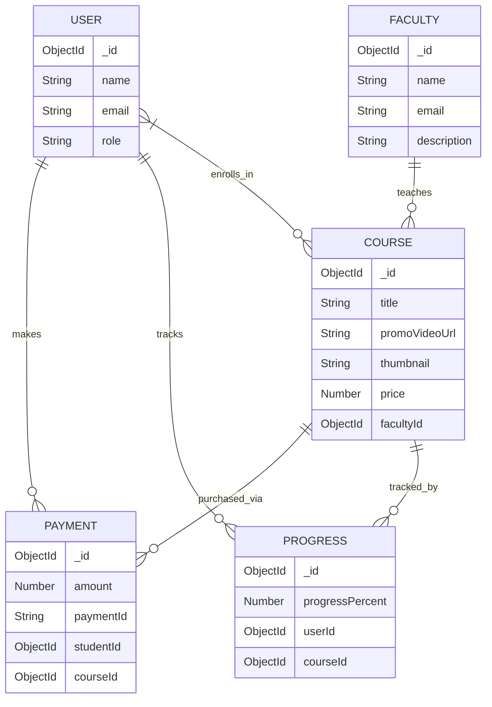
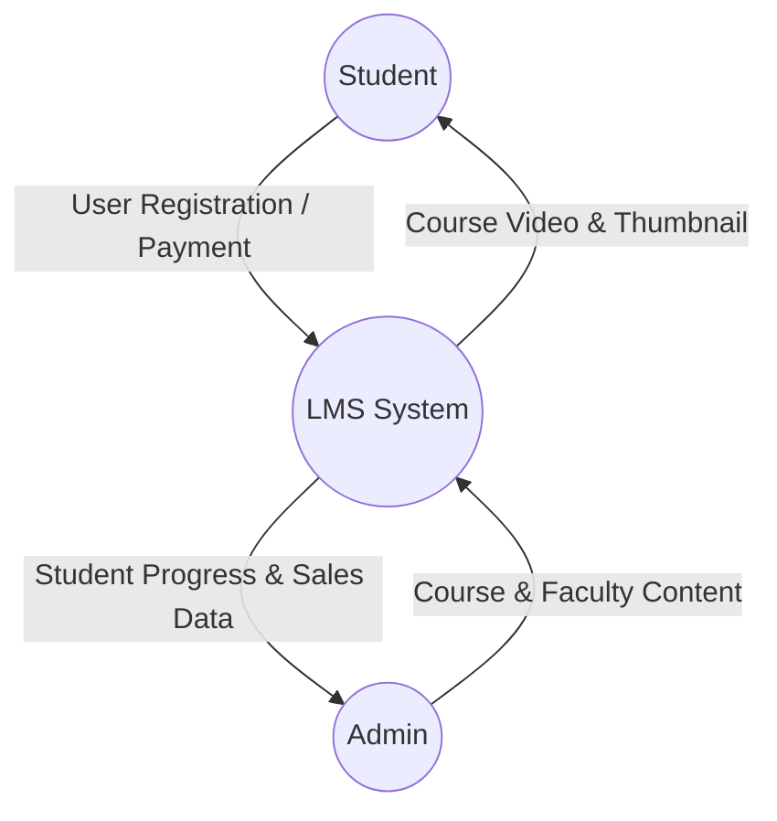

# LMS Project System Documentation

## 1. Database Tables (Collections) In Use

The project uses MongoDB as the database. Here is the list of all collections (tables) currently in use for the simplified architecture:

1. **Users** (`User`): Stores user and admin accounts, authentication details, and course enrollments.
2. **Courses** (`Course`): Stores information about courses, including the title, description, pricing, category, the main course video link, and the course thumbnail.
3. **Faculties** (`Faculty`): Stores profiles for faculty members who are assigned to courses for teaching/mentorship.
4. **Payments** (`Payment`): Tracks payment transactions made via Razorpay for course enrollments.
5. **Progresses** (`Progress`): Tracks the learning progress of students for each course they are enrolled in.

---

## 2. Table / Schema Structures

### User Table (`User`)
- `_id`: ObjectId
- `name`: String (Required)
- `email`: String (Required, Unique)
- `password`: String (Required, Hashed)
- `role`: String (Enum: `student`, `admin`, Default: `student`)
- `avatar`: String (Profile Picture)
- `enrolledCourses`: Array of ObjectIds (Ref: `Course`)
- `timestamps`: createdAt, updatedAt

### Course Table (`Course`)
- `_id`: ObjectId
- `title`: String (Required)
- `description`: String (Required)
- `thumbnail`: String (Main Course Image)
- `promoVideoUrl`: String (Direct Link to the Course Video)
- `category`: String (e.g., Web Development, Data Science)
- `faculty`: ObjectId (Ref: `Faculty`)
- `price`: Number (0 for free courses)
- `isPublished`: Boolean
- `level`: String (Beginner, Intermediate, Advanced)
- `timestamps`: createdAt, updatedAt

### Faculty Table (`Faculty`)
- `_id`: ObjectId
- `name`: String (Required)
- `email`: String (Required, Unique)
- `description`: String (Bio/Details)
- `profileImage`: String
- `timestamps`: createdAt, updatedAt

### Payment Table (`Payment`)
- `_id`: ObjectId
- `student`: ObjectId (Ref: `User`, Required)
- `course`: ObjectId (Ref: `Course`, Required)
- `amount`: Number (Required)
- `paymentId`: String (Razorpay Payment ID)
- `orderId`: String (Razorpay Order ID)
- `status`: String (e.g., 'captured')
- `timestamps`: createdAt, updatedAt

### Progress Table (`Progress`)
- `_id`: ObjectId
- `userId`: ObjectId (Ref: `User`, Required)
- `courseId`: ObjectId (Ref: `Course`, Required)
- `progressPercent`: Number (0-100% of course completion)
- `isCompleted`: Boolean (Whether the user finished the course)
- `timestamps`: createdAt, updatedAt

---

## 3. Entity Relationship (ER) Diagram



---

## 4. Data Flow Diagram (DFD)

### Level 0 DFD (Context Diagram)



### Level 1 DFD (Process Level Diagram)

```mermaid
flowchart TD
    subgraph External Entities
        Student((Student))
        Admin((Admin))
        PaymentGateway((Razorpay))
    end

    subgraph Processes
        P1[1.0 Authentication]
        P2[2.0 Content Management]
        P3[3.0 Payment & Enrollment]
        P4[4.0 Course Delivery & Progress]
    end

    subgraph Data Stores
        D1[(D1: Users)]
        D2[(D2: Courses)]
        D3[(D3: Faculties)]
        D4[(D4: Payments)]
        D5[(D5: Progress)]
    end

    %% Authentication
    Student -->|Credentials| P1
    Admin -->|Credentials| P1
    P1 <-->|Verify| D1

    %% Content Management
    Admin -->|Add Course/Video/Faculty| P2
    P2 <-->|Store/Update| D2
    P2 <-->|Store/Update| D3

    %% Payment
    Student -->|Purchase Course| P3
    P3 -->|Gateway Auth| PaymentGateway
    PaymentGateway -->|Success Signal| P3
    P3 -->|Record Payment| D4
    P3 -->|Enable Access| D1

    %% Delivery & Progress
    Student -->|Watch Course Video| P4
    P4 <-- |Fetch Video Link| D2
    P4 <--> |Update Watch Status| D5
```

---

## 5. System Features Summary

- **Simplified Architecture**: Each course is managed as a single complete unit with its own main video and thumbnail, removing the complexity of multi-part lectures.
- **Direct Faculty Connection**: Courses are linked directly to specialized Faculty members for better identification.
- **Secure Payments**: Razorpay integration ensures that only paying students can access the main course content.
- **Progress Tracking**: Monitors user engagement at the course level, allowing students to see their completion status.
- **Role-Based Admin Dashboard**: Admins can manage the entire flow from faculty onboarding to course deployment and financial tracking.
